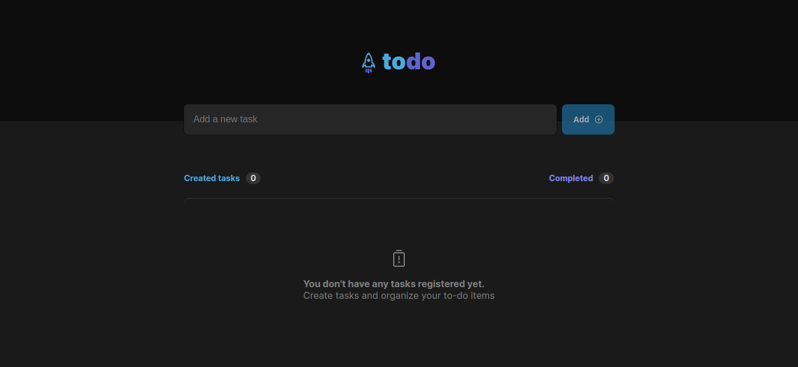
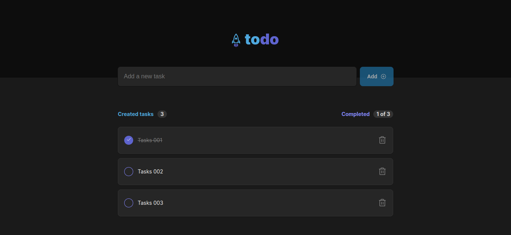

# ignite React|JS 2022
## _In this challenge you will reinforce the most important concepts of ReactJS and learn even more concepts that will be used in all applications that I will develop in the future._

## Features

- States
- State immutability
- Lists and keys in ReactJS
- Properties
- Componentization

## Tech

Stack of technologies used in the project:

- [Vite] - Next Generation Frontend Tooling
- [ReactJS] - A JavaScript library for building user interfaces
- [CSS Modules] -  Is a CSS file in which all class names and animation names are scoped locally by default.
- [TypeScript] - TypeScript is a strongly typed programming language that builds on JavaScript, giving you better tooling at any scale.


## Installation

```sh
git clone https://github.com/adelino-masioli/ignite-challenge-01
cd ignite-challenge-01
npm i
node run dev
```

### Screenshot




## License
MIT
